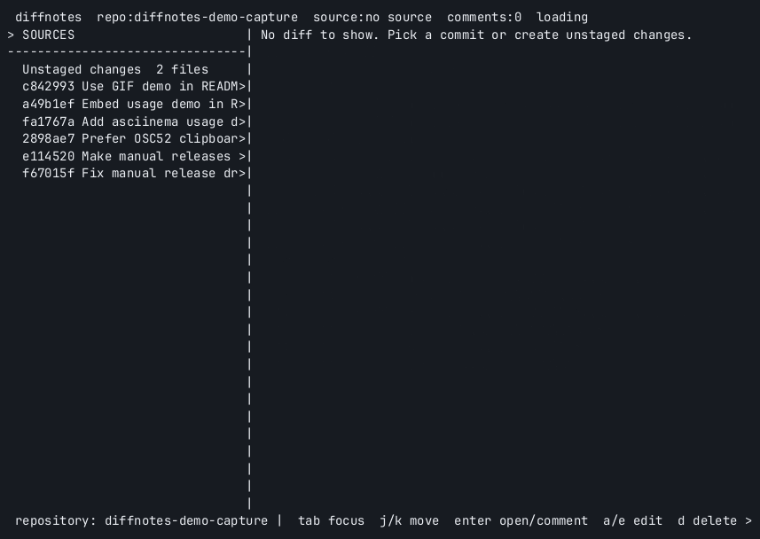

# diffnotes

A terminal Git review tool for leaving local comments on staged changes, unstaged changes, untracked files, or recent commits, then copying all comments into the system clipboard for an LLM coding agent.

The layout is intentionally close to a GitHub pull request diff: file headers, hunk headers, old and new line number columns, green additions, red deletions, and per-line comment markers.
Saved comments are rendered inline directly below the diff line they are attached to. While adding or editing, the comment input appears inline in that same location and wraps long text.

## Install

```sh
go install ./cmd/diffnotes
```

Or run from this checkout:

```sh
go run ./cmd/diffnotes --repo /path/to/repo
```

## Demo

[](docs/usage.cast)

The embedded GIF is generated from the local asciinema cast and uses this repository as the review target. It walks through opening unstaged changes, adding inline comments, folding to comment context, and copying the agent-ready review text.

For terminal playback:

```sh
asciinema play docs/usage.cast
```

Build release-ish local binaries:

```sh
make build
make build-linux
```

## Releases

GitHub Actions runs tests and cross-compiles macOS/Linux binaries on every push to `main` and every pull request.

Tagged releases are handled by GoReleaser. Run the GitHub Actions `Release` workflow with a semver tag such as `v0.1.0` to create the tag and publish a GitHub release with downloadable artifacts.

You can also push a semver tag yourself to publish a release:

```sh
git tag v0.1.0
git push origin v0.1.0
```

The release workflow publishes:

- `darwin/amd64`, `darwin/arm64`, `linux/amd64`, and `linux/arm64` tarballs
- `checksums.txt`
- Linux packages: `.deb`, `.rpm`, `.apk`, and Arch Linux package archives
- a Homebrew cask update when `HOMEBREW_TAP_TOKEN` is configured

Homebrew publishing requires a separate tap repository, expected by default at `github.com/alexfedosov/homebrew-tap`, and a repository secret named `HOMEBREW_TAP_TOKEN` with contents write access to that tap. Without that secret, GitHub releases and Linux package artifacts still publish, but the Homebrew tap update is skipped.

The generated Linux packages are release assets. To make `apt`, `dnf`, or `apk` install from a repository URL, publish those packages to a package repository service such as Cloudsmith, Gemfury, Packagecloud, or your own distro repository.

## Controls

- `tab`, `h`, `l`, `s`, `f`: switch focus between sidebar and diff
- `j/k` or arrow keys: move selection
- `enter` or `o` in the sidebar: open the selected source
- `enter`, `a`, or `e` in the diff: add or edit a comment on the selected line
- `d` or `x`: delete the comment on the selected line
- `z`: toggle folded comment view, showing each comment with three lines above it grouped by file
- `c` or `y`: copy all comments to the system clipboard
- `r`: reload repository sources
- `q`: quit

Mouse clicks select sidebar entries or diff lines, and the mouse wheel scrolls the focused side.

## Clipboard Support

Clipboard copy uses the native command available on the current platform:

- macOS: `pbcopy`
- Linux Wayland: `wl-copy`
- Linux X11: `xclip` or `xsel`
- Windows: `clip`

When running over SSH, `diffnotes` prefers OSC 52 clipboard sequences so the copy goes to the clipboard of the local terminal, not the remote Linux machine. Your local terminal must allow OSC 52 clipboard access. If you run inside tmux and copy does not reach your local clipboard, enable clipboard passthrough in tmux, for example with `set -g set-clipboard on`.

Set `DIFFNOTES_CLIPBOARD=osc52` to force OSC 52, or `DIFFNOTES_CLIPBOARD=native` to force native clipboard commands. On local Linux, install one of the supported clipboard tools if `c` reports that no clipboard command was found.

## Export Format

Copied comments are grouped by source and include the file path, line number, diff side, message, and the selected code line:

```text
Review comments for coding agent

Source: Unstaged changes (2 files)
- internal/app.go:42 [new]
  Message: This branch should handle empty input before calling the parser.
  Code: result := parse(input)
```
